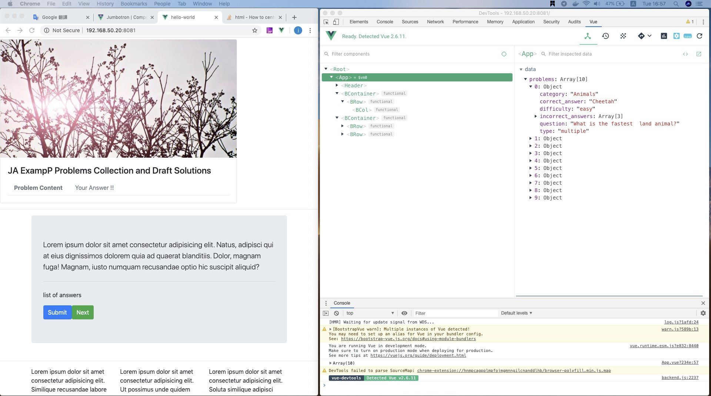
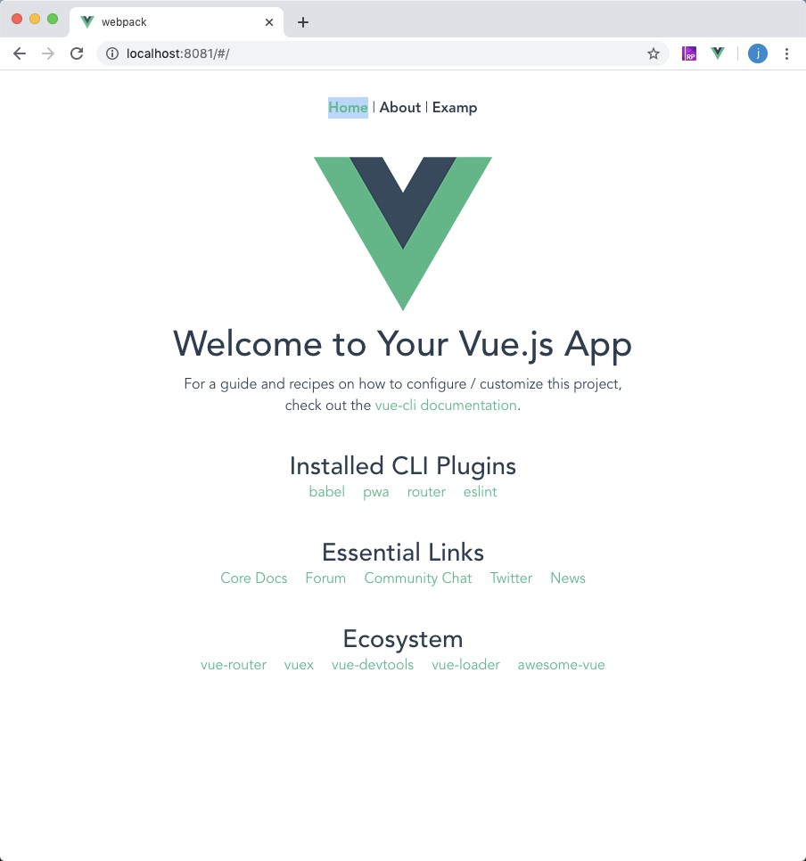
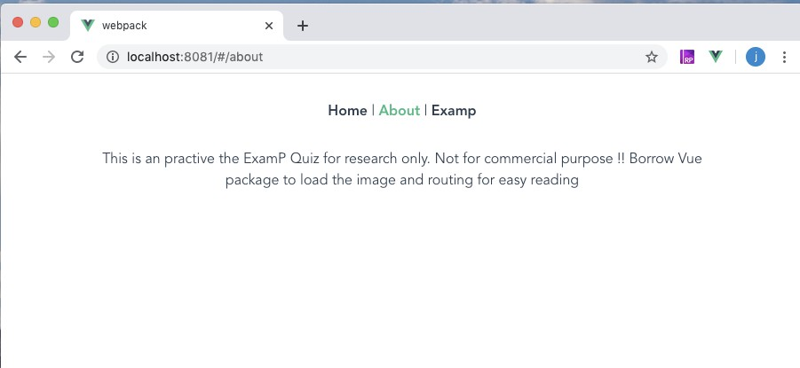
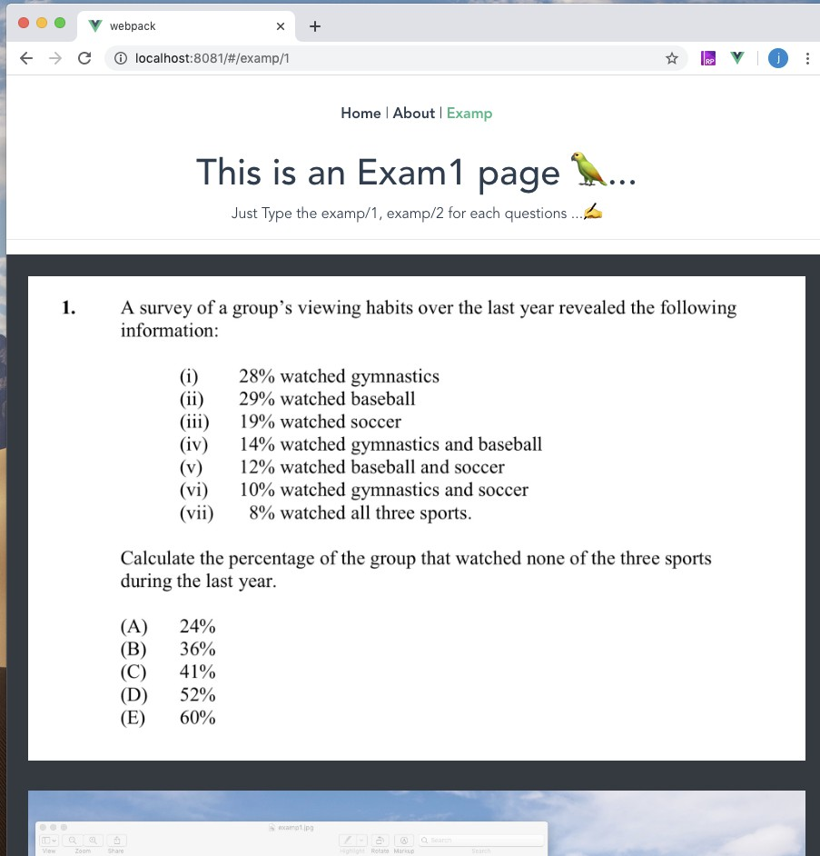
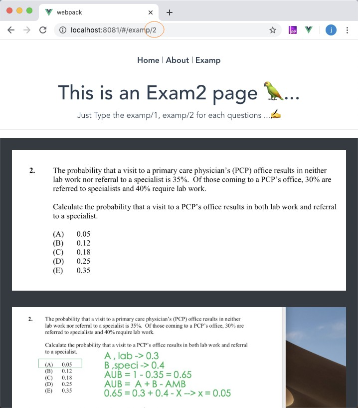
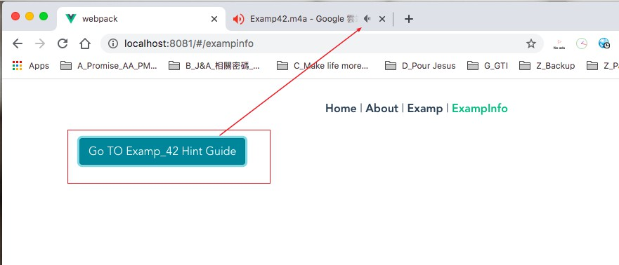

l# vuejs_with_examP_demo
prepare examP in 2020 and make a vuejs framework to review the problem I solved.

## Apres pour penser par long temps..

---

- j'ai trouve que c'etait tres frustrant.. ne connais que le bonjour-monde de vuejs 😓..
- Il est temps de faire une vraie application maintenang ! 🤸🏻‍♂️
- J'ai assigne une de mon equipe, Mary(Front-end) a s'occuper de cette tache.
- The exampP FE display, for learning and add the quiz one by one
- Examp is very good test for your probability-math ability. anyway..let's make it happen!

---

- Build up the env
- Make different endpoint like /examp/1 , /examP/2 ,..

---

## Build up the env 😈 , status

---

- status: done.. ✅
  - following setup_vue_env_history
    - python3 -m venv env (I might need that later)
    - npm install -g @vue/cli-init
    - source ja_init_nvm_env.sh
  - download package vue
    - npm i bootstrap-vue
    - vue create hello-world
    - cd hello_world
    - npm run serve
- working on Vue 🦜....

---

## Use Vue to load data and display problems and answer

---

- use vue-devps for easy debugging

---

## Go to webpack folder and run finish ✅

## by Mary 👌 .

---

- save your question photo and solution photo in following format.
  - src/assets/examp_1.jpg examp_2.jpg
  - src/assets/result_1.jpg result_2.jpg etc..

## Result Demo

- [home](#home)
- [About](#about)
- [Examp](#examp)
- [ExampInFO](#exampinfo)

---

### HomePage 😈

---

---

### AboutPage 📂

---

---

### ExampPage 🐸..

---

- Examp/1 Endpoint :

---

- Examp/2 Endpoint :

  

* Other Detail, pleae go to examp folder and open Reame.md there 🦜...

---

 😙

### ExampInfo Page

---

- recorod some quiz with audio guide.

- 

---
