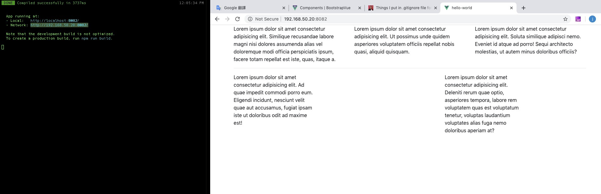
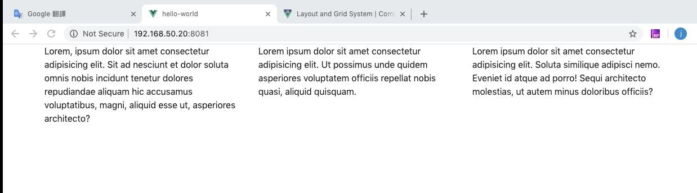
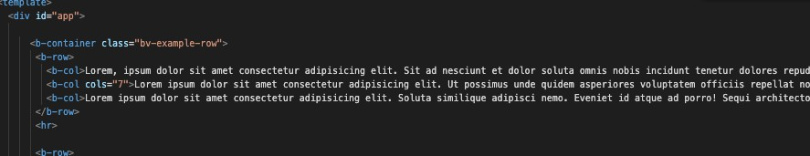
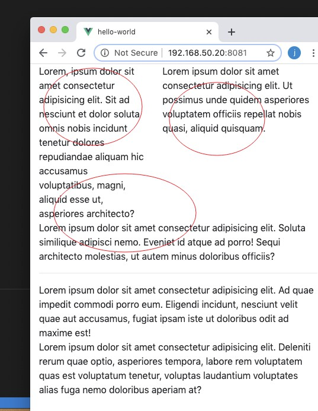
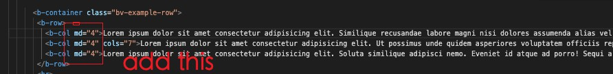
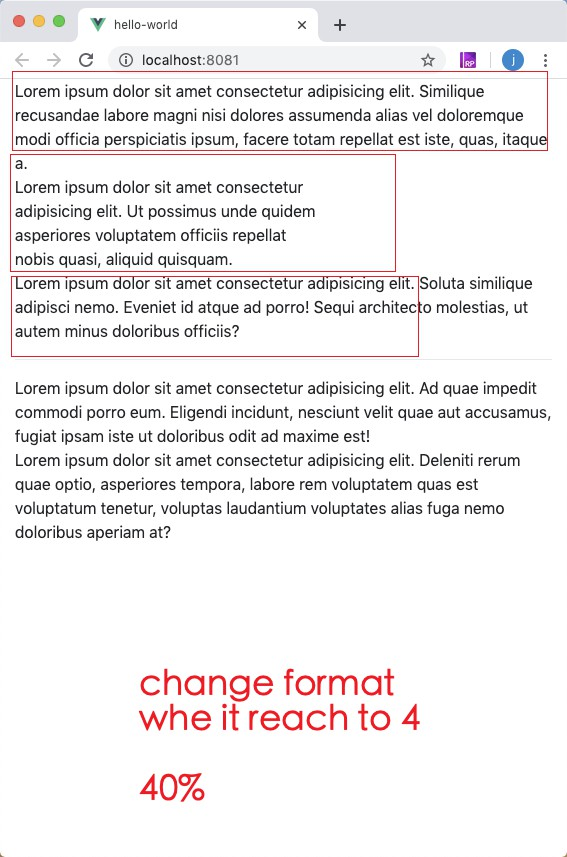
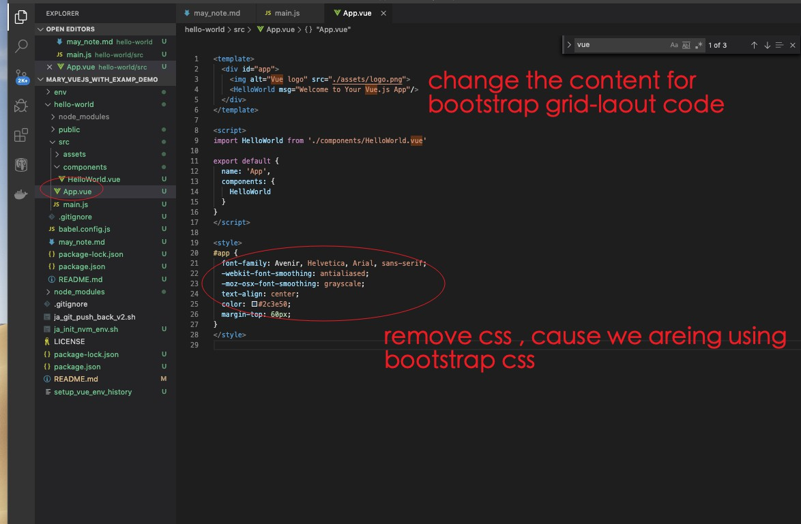

## Vue Bootstrap 😈
---

---

## Register Bootstrap in your app entry-point:
--- 
- in your src: main.js
- import { BootstrapVue, IconsPlugin } from 'bootstrap-vue'

---

## Register and Import BootStrap CSS

---
    - import at the entry point of your application, which is main.js now.
    - check  main.js

--- 
## Get the templated code into App.vue
---

- remove css
    - rmove all in style block in App.Vue file 
- remove hello-world component
- copy the bootstrap's template code into the <template> </template>
- make lorem30 ,lorem20, lorem20 to 3 cols tag and testing
- npm run serve

---
Result: 

--- 

## Dynamic Change the col1 col2 col3 to horizental
---

- Before:
    - code:

     
          
    - test_result:

    

- After: 
    - code:

 

    - improved_result:
     
 

---

---

---

---